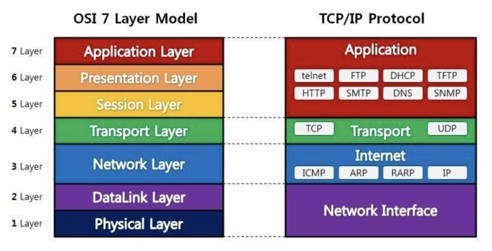
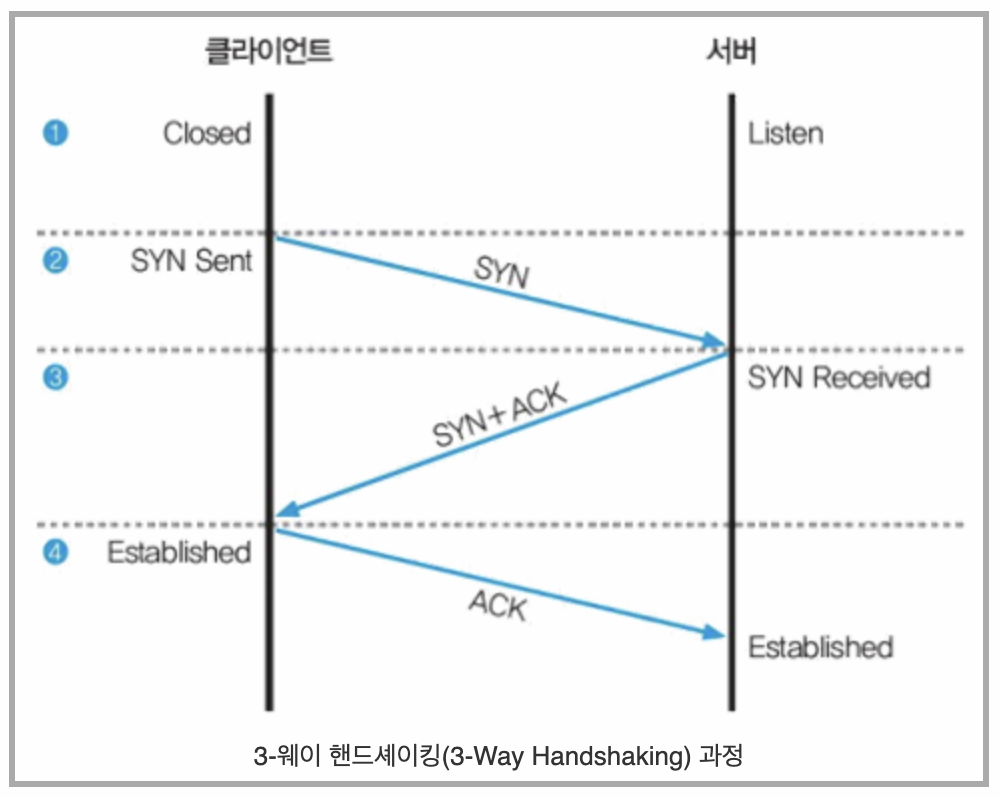

## What is OSI 7 Layer?

OSI 7 계층은 네트웨크에서 통신이 일어나는 과정을 7단계로 나눈 것을 말한다.

> 7계층으로 나눈 이유는?

    통신이 일어나는 과정을 단계별로 파악할 수 있기 때문이다.

    흐름을 한눈에 알아보기 쉽다.
    7단계 중 특정한 곳에 이상이 생기면 다른 단계의 장비 및 소프트웨어를 건들이지 않고도 이상이 생긴 단계만 고칠 수 있따.

</img>

1. 1계층, 물리계층(Physical Layer)
   실제 장치를 연결하기 위한 전기적 및 물리적 세부 사항을 정의한 계층
   인터넷 케이블, 라우터 스의치 등의 전기적 신호가 물리적인 장치에 의해 통신하는 계층
   통신단위는 비트이고 비트는 1과 0, 전기적으로 on, off 상태
   데이터를 전달만 할뿐 전송하거나 받으려는 데이터가 무엇인지, 어떤 에러가 있는지 신경쓰지 않는다.
   데이터를 전기적인 신호로 변환해 주고받는 기능만
   (통신케이블, 리피터, 허브 등)

2. 2계층, 데이터 링크계층(DataLink Layer)
   장치 간 신호를 전달하는 물리계층을 이요해 네트워크 상의 주변 장치들 간의 데이터를 전송하는 역할.
   물리계층을 통해 송수신되는 정보의 오류와 흐름을 관리해 안전한 정보의 전달을 수행하도록 도와주는 역할
   통신에서의 오류를 찾거나 재전송하는 기능이 있고 Mac 주소를 이용해 통신한다.

   MAC(Media Access Control Address: 네트워크 세그먼트의 데이터 링크 계층에서 통신을 위한 네트워크 인터페이서에 할당된 고유 ID) 주소를 가지고 통신을 하는데 전송되는 단위를 프레임이라고 한다.

   두 장치 간의 신뢰정있는 전송을 보장하기 위한 계층.
   데이터 링크 게층에서 전송되는 단위는 프레임

   주소 할당: 물리 계층으로부터 받은 신호들이 네트워크 상의 장치에 올바르게 안착할 수 있게 한다.
   오류 감지: 신호가 전달되는 동안 오류가 포함되는지 감지, 오류가 있다면 해당 데이터를 폐기

3. 3계층, 네트워크 계층(Network Layer)

   데이터를 목적지까지 가장 안전하고 빠르게 전달하는 기능(라우팅)
   경로를 선택하고 주소를 정하고 경로에 따라 패킷을 전달해주는 역할
   여러개의 노드를 거칠때마다 경로를 찾아주는 역할을 하는데 다양한 길이의 데이터를 네트워크를 통해 전달하고 그 과정에서 전송 계층이 요구하는 서비스품질(QoS)을 제고하기 위한 기능적, 절차적 수단을 제공한다.

   네트워크 계층은 라우팅, 흐름 제어, 세그멘테이션, 오류 제어, 인터네트워킹 등을 수행
   라우터가 이 계층에서 동작하고 이 계층에서 동작하는 스위치도 있다.
   데이터를 연경하는 다른 네트워크를 통해 전달함으로써 인터넷이 가능하게 만드는 계층
   논리적인 주소 구조(IP), 곧 네트워크 관리자가 직접 주소를 할당하며 계층적

4. 4계층, 전송 계층(Transport Layer)
   통신을 활성화하기 위한 계층이며 보통 TCP 프로토콜을 이용, 포트를 열어서 응용 프로그램들이 전송을 할 수 있게 한다.
   데이터가 왔아면 4계층에서 해당 데이터를 하나로 통합하여 5계층으로 전달한다

   양끝단의 사용자가 신뢰성 있는 데이터를 주고받게 하여 상위 계층이 데이터 전달의 유효성이나 효율성을 신경쓰지 않게 해주는 계층, 시퀀스 넘버 기반의 오류 제어 방식을 사용
   전송 계층이 패킷들의 전송이 유효한지 확인하고 전송 실패한 패킷들을 다시 전송한다는 것을 뜻함

   end to end 통신을 다루는 최하위 계층으로 종단 간 신뢰성 있고 효율적인 데이터를 전송하며 기능은 오류검출 및 복구와 흐름 제어, 중복 검사 등을 수행한다.

   3-웨이 핸드셰이킹(3-Way Handshaking)
   </img>

> 데이터 통신을 설명할 때 OSI 참조 모델을 사용할 수 있다.

    OSI 참조 모델은 데이터 통신을 7단계로 나누고 이 단계를 계층(layer)라고 부른다.
    각 계층마다 각 계층의 역할을 하는 `프로토콜`이 존재한다.
    각 계층은 독립해있고 하위 계층은 상위 계층을 위해 일하고 상위 계층은 하위에 관여하지 않는다.

> 프로토콜

    통신하기 위한 기술적 약속들, 데이터를 송수신하는 순서와 내용을 결정한다.
    HTTP, TCP/IP, UDP 모두 프로토콜이다.
    현대 internet Protocoldms 보통 layering 되어있다. 상위 계층은 하위 계층의 protocol을 이용해 새로운 protocol을 수립한다.
    프로토콜군은 각각의 계층에서 사용되는 프로토콜을 통합한 것으로 가장 많이 사용되는 것이 TCP/IP 프로토콜군이다.
