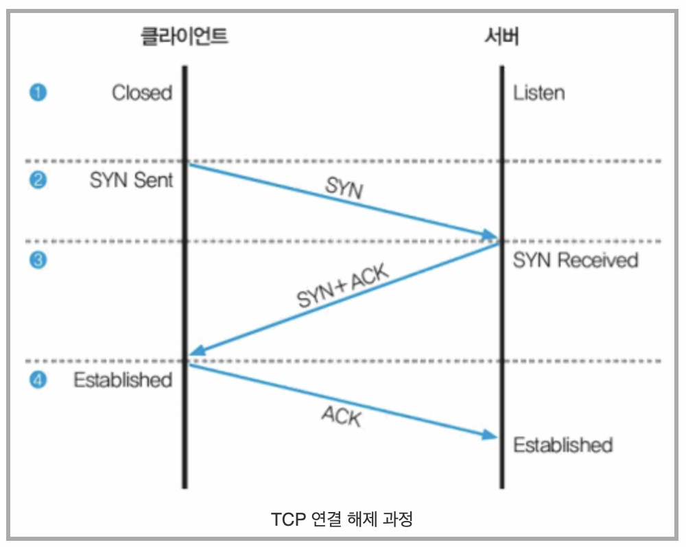

## What happend in TCP connection

> What is TCP(Transmission Control Protocol)?

    신뢰성있는 데이터 전송을 지원하는 연결 지향형 프로토콜
    OSI 7 계층 중 4계층, 전송 계층에 위치

    - 3-way handshake 과정을 통해 연결을 설정하고 4-way handshake 과정을 통해 해제
    - 데이터 흐름 제어(수신자 오버플로우 방지) 및 혼잡 제어(네트워크 내 패킷 수 과도하게 증하 방지)가 가능
    - 높은 신뢰성(Sequence Number, Ack Number를 통한 신뢰성)을 보장
    - UDP 보다 속도가 느림
    - HTTP 웹통신, 이메일, 파일 전송에 사용

> UDP(User Datagram Protocal)

    비연결형 프로토콜
    TCP와 동일하게 4 계층에 위치

    - 정보를 주고 받을 때 정보를 보내거나 받는 handshake를 거치지 않는다.
    - UCP 헤더릐 CheckSum 필드를 통해 최소한의 오류만 검출, 부하가 적음
    - 패킷 손실이 발생할 수 있으며 신뢰성이 낮아
    - TCP보다 속도가 빠르다
    - 신뢰성보다는 연속성이 중요한 서비스에 많이 사용
    - 스트리밍 서비스, 브로드캐스팅 등

> 3-웨이 핸드셰이킹(3-Way Handshaking)

</img>

    1.  1단계

    - 두 시스템이 통신을 하기 전에 클라이언트는 포트가 닫힌 closed 상태
    - 서버는 해당 포트로 항상 서비스를 제공할 수 있는 listen 상태

    2.  2단계

        - 클라이언트가 처음 통신을 하려면 임의의 포트 번호가 클라이언트 프로그램에 할당되고, - 클라이언트는 서버에 연결하고 싶다는 의사 표시로 SYN Sent 상태가 된다.

    3.  3단계

        - 클라이언트의 연결 요청을 받은 서버는 SYN Received 상태가 되고, 클라이언트에 연결을 해도 좋다는 의미로 SYN + ACK 패킷을 보낸다.

    4.  4단계

        - 클라이언트는 연결 요청에 대한 서버의 응답을 확인했다는 표시로 ACK 패킷을 서버로 보냄

 

> TCP 연결 해제 과정

</img>

    1.  1단계

        - 통신 중에는 클라이언트와 서버 모두 Established 상태

    2.  2단계

        - 통신을 끊으려는 클라이언트가 서버에 FIN 패킷을 보내고 클라이언트는 Close Wait 상태가 된다.

    3.  3단계

        - 서버는 클라이언트의 연결 종료 요청을 확인하고 응답으로 클라이언트에 ACK 패킷을 보내면 서버도 클라이언트의 연결을 종료하겠다는 의미로 FIN 패킷을 보내고 Close Wait 상태가 된다.

    4.  4단계
        - 클라이언트는 연결 종료를 요청한 것에 대한 서버의 응답을 확인했다는 표시로 ACK 패킷을 서버에 보낸다.
