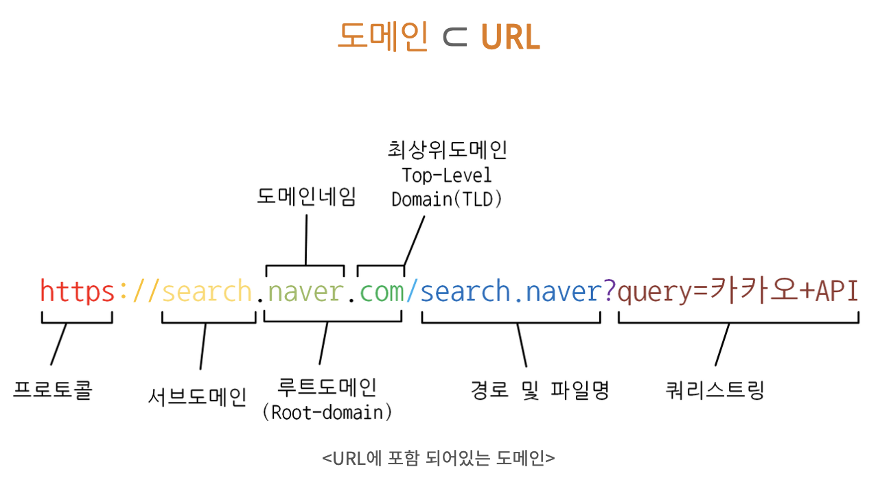

## What happens when I search `google.com`?

1. 사용자가 웹 브라우저를 통해 `google.com` 입력
2. URL 주소 중 도메인 네임 부분을 DNS 서버에서 검색한다.

> DNS (Domain Name System)

    사람이 읽을 수 있는 도메인 (ex. www.google.com )을 컴퓨터와 같은 기계가 읽을 수 있는 IP 주소로 변환하는 것

    LIKE 전화번호,
    이채현(도메인) 010-1234-5678(IP)

    DNS 서버는 이름에 대한 요청을 IP 주소로 변환해 최종 사용자가 도메인 이름을 웹 브라우저에 입력할 때 사용자를 어떤 서버에 연결할 것인지 제어한다. 이 요청울   `쿼리` 라고 부른다.

> 도메인 (인터넷 상에서의 주소, URL의 일부)

    외우기 힘든 IP 주소를 google.com 처럼 기억하기 쉽게 만들어주는 `네트워크 호스트 이름`을 말한다.

    </img>
